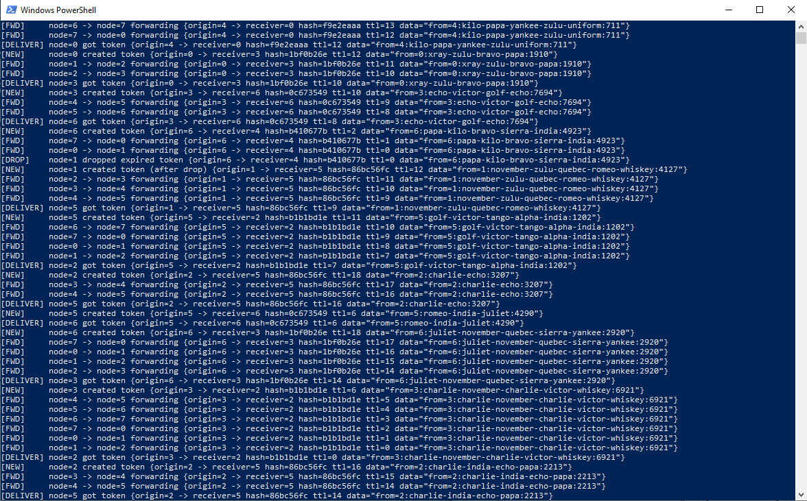

# Token Ring Emulator (Go)

Данный проект представляет собой эмулятор протокола **Token Ring**, реализованный
на языке **Go 1.25** с использованием **стандартной библиотеки**.

Каждый узел сети моделируется отдельной goroutine и связан с соседними узлами
через каналы (`channel`), образуя логическое кольцо.

---

## Описание работы

- Узлы соединены в кольцо и передают друг другу сообщения (Token)
- Сообщение содержит:
  - произвольные данные
  - SHA3-256 хэш идентификатора узла-получателя
  - счётчик времени жизни (TTL)
- Узлы пересылают Token по кольцу, пока:
  - сообщение не достигнет адресата (по совпадению хэша)
  - либо TTL не станет равен 0
- Узел, получивший сообщение, автоматически создаёт новое сообщение
  с произвольным получателем
- При истечении TTL сообщение отбрасывается, после чего создаётся новое

Вся работа эмуляции сопровождается логированием в консоль.

---
## Запуск программы
- go run main.go -n <число_узлов>

